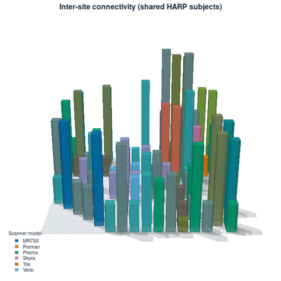

# BCIL
Brain Connectomics Imaging Libraries

## Installation
1. Requires FSL (>=6.0), WORKBENCH (>=2.0.0), FreeSurfer (>=6.0.0) , matlab (>=2022b), R (>=4.3.0)

* matlab toolbox: DSE decomposition (https://github.com/asoroosh/DVARS)
* R toolbox: ggplot2, qcc
* jq
* ImageMagick

2. Donwload zip file of bcil and unzip the file
3. Configure the setting file ([unzipped directory]/bcilconf/settings.sh) for your environments

Default settings are:
```
export CARET7DIR=/usr/local/workbench/
export HCPPIPEDIR=/mnt/pub/devel/HCPPipeline
export FREESURFER_HOME=/usr/local/freesurfer-v0.0.0
export FSLDIR=/usr/local/fsl
export DVARSDIR=/mnt/pub/devel/git/DVARS-master
```
Please edit the paths using *nano* (or whatever editor you like) for your environments. CARET7DIR is the path to Workbench, HCPPIPEDIR to HCP pipeline, FREESURFER_HOME  to FreeSurfer, and DVARSDIR to DSE decomposition.

4. Set path to [unzipped directory]/bin
```
export PATH=[unzipped directory]/bin:$PATH
```
5. Run commands in the directory, [unzipped directory]/bin

### Optional: run the QC plots without a MATLAB license (MATLAB Runtime)

`hcppipe_qc` renders two of its figures (motion/greyordinate/DVARS plot and the
time-series plot) with MATLAB. By default these run in a live MATLAB session,
which needs a MATLAB license at run time. Alternatively you can run them on the
free MATLAB Runtime (MCR) with prebuilt standalone binaries, so **no MATLAB
license is consumed** when running `hcppipe_qc`.

Prebuilt binaries for **Linux x86_64 / MCR R2022b (v9.13)** are shipped in
`bin/compiled/`. On that platform you can skip straight to step 2. To run on a
different OS or MCR version, rebuild first (step 1).

1. (Only if you need to (re)build — e.g. other OS/MCR version.) Needs MATLAB with
   **MATLAB Compiler** and **Statistics and Machine Learning Toolbox** at build
   time; the `mcc` version must match the MCR version you will run with
   (R2022b = v9.13):
   ```
   MATLABROOT=/usr/local/MATLAB/R2022b bin/compile_qc_matlab.sh
   ```
   This regenerates `bin/compiled/{bcil_tsplot,bcil_motiongreyplot}` and their
   `run_*.sh` launchers. (Building needs a Compiler + Statistics license;
   *running* the result needs only the free MCR.)

2. In `bcilconf/settings.sh` switch the mode and point to the Runtime:
   ```
   export MATLAB_MODE=runtime
   export MCRROOT=/usr/local/MATLAB/R2022b    # an installed MCR (e.g. .../MATLAB_Runtime/v913) or a matching full MATLAB root
   ```

Leave `MATLAB_MODE=matlab` (the default) to keep using a live MATLAB session;
the behaviour is identical in both modes.

Followings are useful for QCing an individual subject:
```
$ hcppipe_qc
```
, which generates images and brain MRI quality metrics (BQM), and for group-wise QC:
```
$ hcppipe_gqc
```
, which generates control charts for many BQM across subjects and sites (or protocols).

Note that confidence levels in each chart are currently created by a conventional Shewhart's method based on assumptions of normality (ordinary metrics) or Poisson distribution (count data). Fully non-parametric method is under development for future release!

### Group QC summary page

`hcppipe_gqc` writes a `summary/qc_summary.html` page that, for multi-site /
travelling-subjects studies, includes a Site/Project overview (scanner model,
coil, demographics, per-site subject/session counts), a cohort age distribution,
and an **inter-site connectivity matrix** — how many subjects were scanned at
each pair of Site/Projects. The connectivity matrix is shown as a 2-D heatmap and,
when the page is opened online, also as an **interactive 3-D chart** (bars =
shared-subject counts, colored by the blend of the two sites' scanner-model
colors; drag to rotate, scroll to zoom).

[](https://riken-bcil.github.io/bcil/)

**▶ [Open the interactive 3-D version](https://riken-bcil.github.io/bcil/)** (needs a
WebGL browser with internet access). The GitHub README cannot run the interactive
chart itself, so the animation above is a preview that links to the live page
hosted on GitHub Pages. To enable it for this repository (one-time): *Settings →
Pages → Build and deployment → Source: Deploy from a branch → Branch: `master`,
folder `/docs` → Save*. The page then appears at the link above within a minute.

## References

If you use these tools, please cite:

- For the multi-site harmonization protocol (HARP) and travelling-subject design:
  Koike S, Tanaka SC, Okada T, Aso T, Yamashita A, Yamashita O, et al.
  Brain/MINDS beyond human brain MRI project: A protocol for multi-level
  harmonization across brain disorders throughout the lifespan.
  *NeuroImage: Clinical*. 2021;30:102600.
  doi:[10.1016/j.nicl.2021.102600](https://doi.org/10.1016/j.nicl.2021.102600)

- For the surface defect score (SDS) and automated cortical-surface QC:
  Oi Y, Hirose M, Togo H, Yoshinaga K, Akasaka T, Okada T, Aso T, Takahashi R,
  Glasser MF, Hayashi T, Hanakawa T. Identifying and reverting the adverse
  effects of white matter hyperintensities on cortical surface analyses.
  *NeuroImage*. 2023;281:120377.
  doi:[10.1016/j.neuroimage.2023.120377](https://doi.org/10.1016/j.neuroimage.2023.120377)
